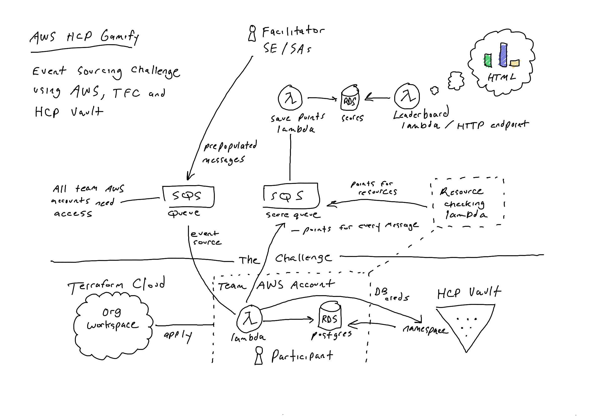

# Gamify AWS and HCP

This repo is designed for a facilitator of a "GameDay" event. The facilitator will use this repository to setup the components needed to run the event. 

Use this event structure to generate excitement for an account with relevant architecture and ultimately drive HCP consumption with AWS. 

See the [participant repository](https://github.com/acornies/gamify-aws-hcp-participant) for the challenge details.

## Event Architecture

## Prerequisites

The following is a list of resources needed before the start of the event:

### Facilitators SE/SAs

- Review the [setup](./setup/) folder to execute the necessary Terraform
- Review the [solution](./solution/) folder to see a example code solution to the challenge
- An HCP account (@hashicorp.com email address)
- A Terraform Cloud Plus/Business org (#team-se-trial-rqsts Slack channel)
- A new GitHub organization for the event
  - A list of teams and attendees
- An AWS account vended by AWS Workshop Studio

### Participants

- Internet access, web browser
- A GitHub account
- Terraform Cloud org and workspace
  - Team token
- HCP Vault endpoint
  - Namespace (team or participant name)
- An AWS account vended by AWS Workshop Studio

Personal GitHub accounts are needed to add participants to an event organization team. It is recommended to create a new GitHub org specific to the GameDay event.

## Contributors

See the [src](./src/) directory for source code of the following components:

- The leaderboard HTTP service (Lambda HTTP function)
- The leaderboard record service (Lambda SQS function)
- The leaderboard HTML frontend (leaderboard graph)